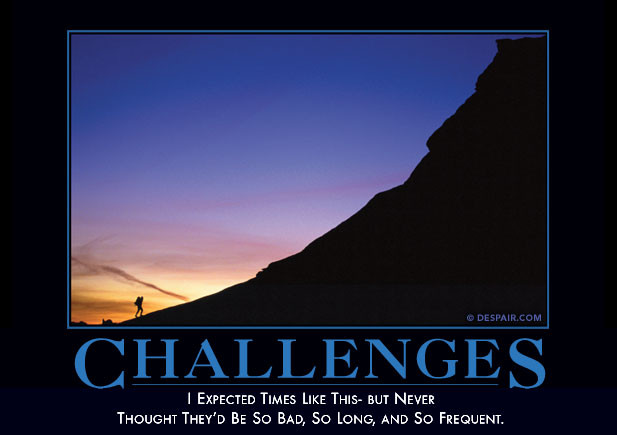

# Changing Direction

## or
## How I doubled my salary while moving from academia to industry.<!-- .element: class="fragment" data-fragment-index="0" -->


## Hint:



## About me four years ago:
* worked in neurosicence as a sysadmin/developer
* loved my job, working in science, loved coding
* boss was a Howard Hughes Investigator (decent pay, great benefits)
* job was pretty stable for staff in academia


## Boss decided to move across the country
## Suddently unemployed<!-- .element: class="fragment" data-fragment-index="1" -->
## But, I had over 10 years experience as a sysadmin/developer<!-- .element: class="fragment" data-fragment-index="2" -->
Sounds good, right?<!-- .element: class="fragment" data-fragment-index="3" -->


## Issues
* Recession.<!-- .element: class="fragment" data-fragment-index="1" -->
* Sysadmin, most marketable skill, also my least favorite.<!-- .element: class="fragment" data-fragment-index="2" -->
* Languages coded in were mostly irrelevant to industry.<!-- .element: class="fragment" data-fragment-index="3" -->
* self-taught, worked in a vacuum.<!-- .element: class="fragment" data-fragment-index="4" -->
* Only knew two other developers in Seattle.<!-- .element: class="fragment" data-fragment-index="5" -->


### Only knew two other developers in Seattle


# Lessons
* Never assume
* Always be preparing for your next step


# Spent a good year flailing


## Soul Searching
* Wanted to code, not sysadmin
* Introvert, but clearly needed to figure out this networking thing


## Lessons
* Direction, goals help
* Concentrate on what brings the most bang for your buck
- for me, interview over whiteboarding
- talks, teaching over small talk

Note: Throwing resumes willy nilly to see if they stick is not productive
If you have a tight resume/linkedin, you can get some headway with recruiters,
but inside help with get you past your deficiencies

Note: Story about whiteboard coding, 


# Serendipity


## My approach:
* code, code, code
* get to know other developer
* learn nuts and bolts of job hunting in 21st century
* find support, may be a long haul


# Fortunately, there is significant overlap


## Support with others looking for work
* exchange resumes, cover letters, practice interviews<!-- .element: class="fragment" data-fragment-index="1" -->
* practice coding interviews<!-- .element: class="fragment" data-fragment-index="2" -->
* Matt Youngquist and Career Horizons<!-- .element: class="fragment" data-fragment-index="3" -->
* WA State Career Centers<!-- .element: class="fragment" data-fragment-index="4" -->


## coding meetups, coding dojos, hackathons, programming nights
* learn
* meet people
* craftsmanship
* find your people


## Create the support you need


## Online Presence
* LinkedIn
* Github
* Blog


# Yes, the odds are stacked against you.


## Implicit Bias


## StereoType Threat


Create these by placing 3 line-breaks in the markdown source.

_From here, you can move `LEFT`, `RIGHT`, or `DOWN`._ <!-- .element: class="fragment" data-fragment-index="0" -->

_Try `DOWN`._ <!-- .element: class="fragment" data-fragment-index="1" -->


## This is a vertical-slide
You make these by placing 2 line-breaks within the source.

Vertical-slides are good for drilling in to topics. Think of it as a _details_ slide. If you're short on time, you can skip past these slides by moving `RIGHT`.


## You can put images in a slide


<!-- .slide: data-background="MintCream" -->
## Style

You can style each slide individually.

_Cool background, right?_<!-- .element: class="fragment" data-fragment-index="1" -->
```
<!-- .slide: data-background="MintCream" -->
## Style

You can style each slide individually.
```


## Hey, it even supports code!

```
var marker = L.marker([49, 5.49]).addTo(map);
var polygon = L.polygon([
  [51.509, -0.08],
  [51.503, -0.06],
  [51.51, -0.047]
]).addTo(map);
marker.bindPopup("<b>Hello world!</b><br>I am a popup.").openPopup();
polygon.bindPopup("I am a polygon.");
```


## Want to see something _really_ crazy?

Press `S` to check out the 'Presentation Mode'.

Note:
The idea is that you put the other window on a shared screen, like a projector, and view this screen on your laptop. Btw, this note is only visible to the presenter.


## That's about it

There are a bunch of cool things you can do with **Reveal.js** and **Markdown**.

Check out Reveal.js' [example slides](http://lab.hakim.se/reveal-js/) for more quick examples of what you can do with Reveal.js.  Check out Reveal.js' [Readme](https://github.com/hakimel/reveal.js/blob/master/README.md) and its [wiki](https://github.com/hakimel/reveal.js/wiki) (especially the [Articles & Tutorials](https://github.com/hakimel/reveal.js/wiki/Articles-&-Tutorials) section) for greater detail about using Reveal.js.  

Check out this [Markdown Cheatsheet](https://github.com/adam-p/markdown-here/wiki/Markdown-Cheatsheet) for a quick intro into using Markdown.
