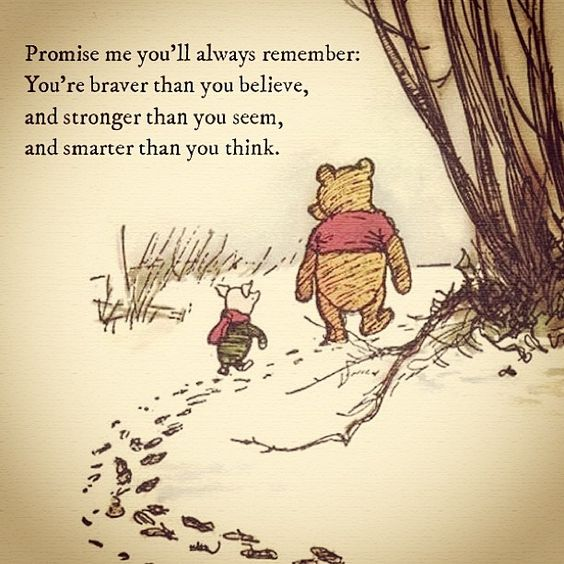

# Changing Direction

## or
## How I doubled my salary while moving from academia to industry<!-- .element: class="fragment" data-fragment-index="0" -->

## About me five years ago:
* worked in neurosicence as a sysadmin/developer
* loved my job, working in science, loved coding
* boss was a Howard Hughes Investigator (decent pay, great benefits)
* job was pretty stable for staff in academia

Note:
My name is Maria Mckinley, and I am calling my talk Changing Direction, because I think the lessons I learned will be helpful to anyone moving into a career in software development.

## Boss decided to move across the country
## Suddenly unemployed<!-- .element: class="fragment" data-fragment-index="1" -->
## But, I had over 10 years experience as a sysadmin/developer<!-- .element: class="fragment" data-fragment-index="2" -->
Sounds good, right?<!-- .element: class="fragment" data-fragment-index="3" -->

## Issues
* Recession<!-- .element: class="fragment" data-fragment-index="1" -->
* Sysadmin, most marketable skill, also my least favorite<!-- .element: class="fragment" data-fragment-index="2" -->
* Languages coded in were mostly irrelevant to industry<!-- .element: class="fragment" data-fragment-index="3" -->
* self-taught, worked in a vacuum<!-- .element: class="fragment" data-fragment-index="4" -->
* Only knew two other developers in Seattle<!-- .element: class="fragment" data-fragment-index="5" -->

### Only knew two other developers in Seattle

# Spent a good year + flailing

## Desperation is not a good job hunting mode
* create or join a group of people looking for work<!-- .element: class="fragment" data-fragment-index="1" -->
    * acquaintances/friends/meetup group
    * exchange resumes, cover letters, practice interviews
* More general or professional help:<!-- .element: class="fragment" data-fragment-index="2" -->
    * WA State Career Centers
    * Matt Youngquist and Career Horizons

# Serendipity

Note:
this shows again the importance of knowing people
When to take a job: does it take you closer to where you want to be? Yes, pressure off, coding, very littley sysadmin
In job I love, but has some critical flaws

## Soul Searching
* Direction: Committed to coding, not sysadmin<!-- .element: class="fragment" data-fragment-index="1" -->
* Goal: job where best practices and developer growth are valued<!-- .element: class="fragment" data-fragment-index="2" -->
* Introvert, but clearly needed to figure out this networking thing<!-- .element: class="fragment" data-fragment-index="3" -->
* Bang for you buck: interviews over whiteboarding<!-- .element: class="fragment" data-fragment-index="4" -->

# A word about networking:
### Your most important connections will have:<!-- .element: class="fragment" data-fragment-index="1" -->
* worked with you<!-- .element: class="fragment" data-fragment-index="1" -->
* coded with you<!-- .element: class="fragment" data-fragment-index="1" --> 
* see you as an expert<!-- .element: class="fragment" data-fragment-index="1" -->

### How do you get this network?<!-- .element: class="fragment" data-fragment-index="2" -->

Note:
If you have a tight resume/linkedin, you can get some headway with company recruiters,
but inside help will help get you past your deficiencies
do survey

#[Find Your Voice](http://emptysqua.re/blog/tech-talks-are-campfires-jesses-three-reasons-you-should-speak-at-pycon/)

Note:
Peter

# Find your people
* coding meetups, coding dojos, hackathons, programming nights
* Code with them!
## Free, you also get:<!-- .element: class="fragment" data-fragment-index="1" -->
* learn craftsmanship/best practices<!-- .element: class="fragment" data-fragment-index="1" -->
* experiment with technologies/fields for right fit<!-- .element: class="fragment" data-fragment-index="1" -->

# Teaching others 

newbies can be the best teachers

## Create the support you need

Note:
Led me to TA position for python certificate program at uw.

# Online Presence
* LinkedIn
* Github
* Blog

## Seek out people in jobs you want and take them to coffee
* use your connections on LinkedIn<!-- .element: class="fragment" data-fragment-index="1" -->
* ask them what skills they use in their job<!-- .element: class="fragment" data-fragment-index="2" -->
* how they got where they are/advice to follow similar path<!-- .element: class="fragment" data-fragment-index="3" -->
* what do they like/dislike about their present position<!-- .element: class="fragment" data-fragment-index="4" -->

# Preparing for interviews:
* People love good stories<!-- .element: class="fragment" data-fragment-index="1" -->
* What are you missing because you are switching careers/paths/industries?<!-- .element: class="fragment" data-fragment-index="2" -->
* What can you do right now to help to close that gap?<!-- .element: class="fragment" data-fragment-index="3" -->
* What have you learned/done that speaks to that?<!-- .element: class="fragment" data-fragment-index="4" -->
* be persistant<!-- .element: class="fragment" data-fragment-index="5" -->

# SCIENCE!

# Yes, the game is rigged against you.

## Implicit Bias
* Implicit bias is a bias that you are unaware of<!-- .element: class="fragment" data-fragment-index="1" -->
* We are all affected by the culture we grow up in<!-- .element: class="fragment" data-fragment-index="2" --> 
* Explicit beliefs and implicit bias can, and often do, conflict<!-- .element: class="fragment" data-fragment-index="3" -->

[Take a test](https://implicit.harvard.edu/implicit/takeatest.html)<!-- .element: class="fragment" data-fragment-index="4" -->

Note:
people will go to great lengths to justify implicit bias.
implicit bias affects minorities and women as well.
If you feel like you nailed an interview, but didn't hear back, think about what you may have missed, but don't dwell. It could just be implicit bias, so just consider that corporation as one we need to lure from the dark side, and move on.
for people hiring: check your assumptions, are you rejecting someone for reasons that you would overlook if they were white male? Look at pictures of famous women/minorities before interviewing/looking at resumes.

# You may also be working against yourself

# StereoType Threat

## How to overcome:
* support - pyladies, seek out role models who 'look like you'<!-- .element: class="fragment" data-fragment-index="1" -->
* think about what makes you, you. All of your unique qualities and accomplishments<!-- .element: class="fragment" data-fragment-index="2" -->
* read articles/books about women/minorities who code<!-- .element: class="fragment" data-fragment-index="3" -->
* intelligence is not fixed; you are capable of becoming an expert coder: effort and motivation are what is important<!-- .element: class="fragment" data-fragment-index="4" -->
* body language, check out<!-- .element: class="fragment" data-fragment-index="5" --> [Amy Cuddy's Ted talk](https://www.youtube.com/watch?time_continue=175&v=Ks-_Mh1QhMc)<!-- .element: class="fragment" data-fragment-index="5" -->

# Imposter Syndrome

## How to overcome:
* knowledge is power<!-- .element: class="fragment" data-fragment-index="1" -->
* highly prevalent, can affect anyone, not just women/minorities<!-- .element: class="fragment" data-fragment-index="2" -->
* talk about it, chances are you have friends you have dealt with this<!-- .element: class="fragment" data-fragment-index="3" -->
* make a list of accomplishments, positive feedback and success stories<!-- .element: class="fragment" data-fragment-index="4" -->

## If you remember nothing else from this talk:
* Code with others <!-- .element: class="fragment" data-fragment-index="1" -->
* Find your voice <!-- .element: class="fragment" data-fragment-index="2" -->
* Have a goal <!-- .element: class="fragment" data-fragment-index="3" -->
* use version control and write tests ;)<!-- .element: class="fragment" data-fragment-index="4" -->

Note:
As with the literal act of gardening, pursuing any practice seriously is a generative, hardy way to live in the world. You are in charge (as much as we can ever pretend to be — sometimes like a sea captain hugging the rail in a hurricane); you plan; you design; you labor; you struggle. And your reward is that in some seasons you create a gratifying bounty.  -Malamud Smith

And now, if you will excuse me, I have to update my linkedin account, fix my blog and write some code...

### Thank you!

https://codedragon.github.io/Puppy_career_talk/#/

## Links to relevant research
[Great essay about sterotype threat with lots of research links](https://medium.com/@BoutiqueAcademia/fighting-stereotype-threat-with-jewelry-680b406296e#.9jo1yzob7) (Bonus cool [jewelry](http://www.boutiqueacademia.com/)) Perhaps she would make python jewelry...

[Gender discrimination in hiring](http://www.socialjudgments.com/research.html)

[Great book about gender, society and neuroscience](http://www.goodreads.com/book/show/8031168-delusions-of-gender)

[Implicit bias overview, links to research and Harvard test](https://perception.org/research/implicit-bias)

[Maria Klawe's, president of Harvey Mudd College, essay on Imposter Syndrome
](http://www.slate.com/articles/technology/future_tense/2014/03/imposter_syndrome_how_the_president_of_harvey_mudd_college_copes.html)

